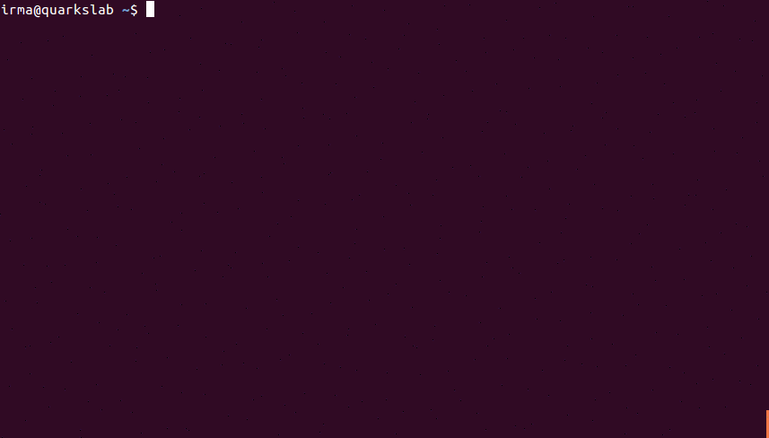
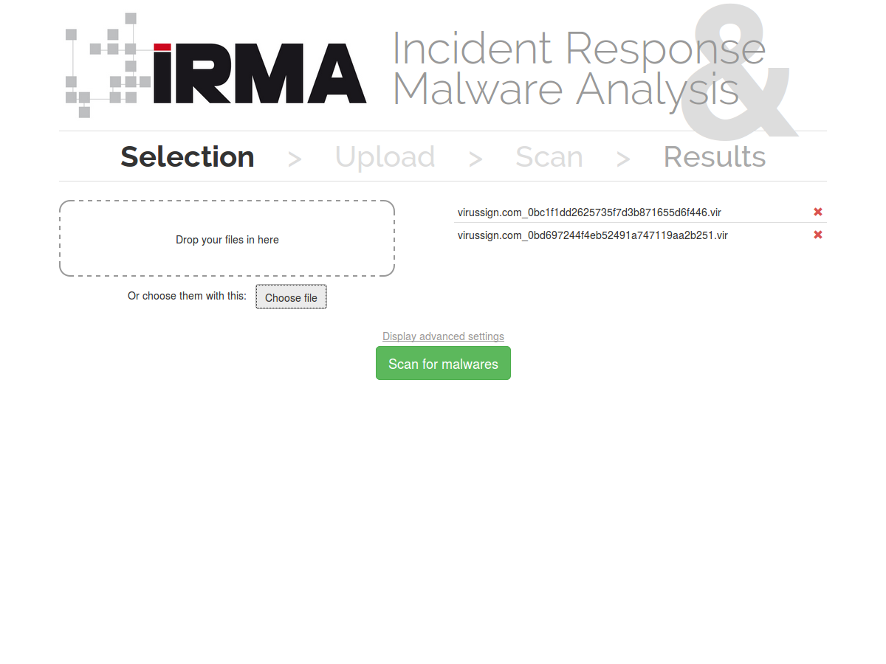

==========================================
IRMA: Incident Response & Malware Analysis
==========================================

IRMA is an asynchronous & customizable analysis system for suspicious files.

This guide will explain how to set up IRMA's probes, use them and customize
them.

Table of Contents
=================

.. toctree::

   irma/index.rst
   probes/index.rst
   references/index.rst
   irma/faq.rst

Resources
=========

* `Project website <http://irma.quarkslab.com>`_
* `IRC <irc://irc.freenode.net/qb_irma>`_  (irc.freenode.net, #qb_irma)
* `Twitter <https://twitter.com/qb_irma>`_ (@qb_irma)

Screenshots
===========

Command Line Interface
----------------------

A sample script can be found in frontend repository. Add your own frontend address before testing it.

Web Interface
-------------

Some screenshots of the irma user interface shipped with frontend package.

.. NOTE: Set Upload & Scan screenshots in comments
    .. image:: images/screenshots/webui/webui2.png
    :alt: Uploading ...
    .. image:: images/screenshots/webui/webui3.png
    :alt: Scanning ...

.. image:: images/screenshots/webui/webui4.png
   :alt: Scan Results
