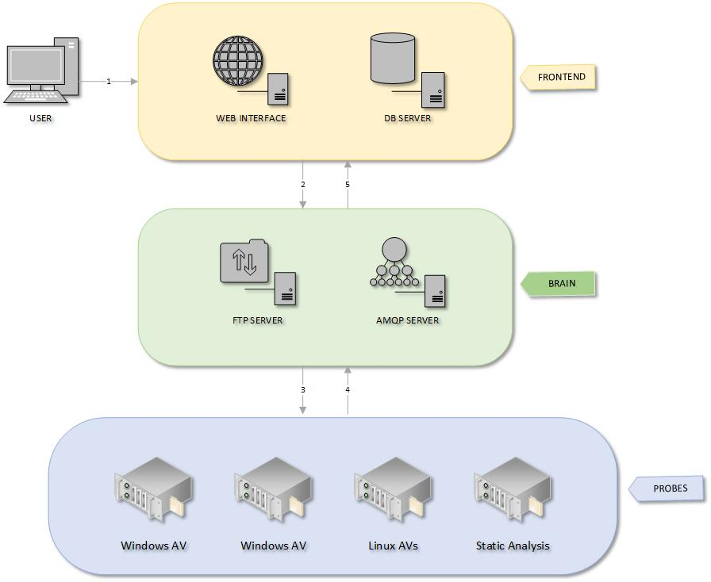

File Analysis Process
=====================

IRMA consists or three basic components. the **Frontend**, **Brain** and **Probes**.
The basic functionality of **frontend** is to store results and host the API.
**Brain** split analysis jobs on every **probes** involved, and **Probes**
analyze files and returns results.

#. An analysis begins when a user uploads files to the **Frontend**.
#. **Frontend** checks for existing files and results in SQL. If needed,
   it stores the new files and calls asynchronously scan jobs on **Brain**.
#. **Brain** worker sends as much subtasks to **Probe(s)** as needed.
#. **Probe** workers process their jobs and send back results to **Brain**.
#. **Brain** sends results to **Frontend**.

