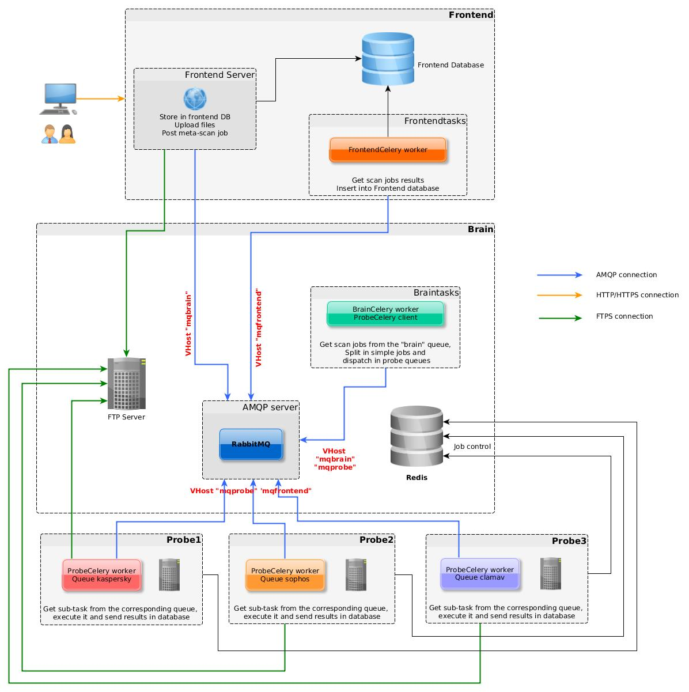

Technical description
=====================
Each major component of the IRMA platform comes with their own python-based
application. As the **Brain** is the nerve center of the whole platform, it is
recommended to install it first before installing other components. One can then
install either the **Frontend** or the **Probes** he wants.

The IRMA entrypoint is the web API hosted on **frontend**. File results are stored in
**PostgreSQL database**. All files transfers are done through FTP (**sftp server** on **brain**).
All tasks are executed by celery applications that consumes their own task queue on **RabbitMQ server**.
For further details give a look at **scan workflow** part

.. toctree::

   swagger.rst
   frontend.rst
   brain.rst
   probe.rst
   scan_workflow.rst
   functional_testing.rst
