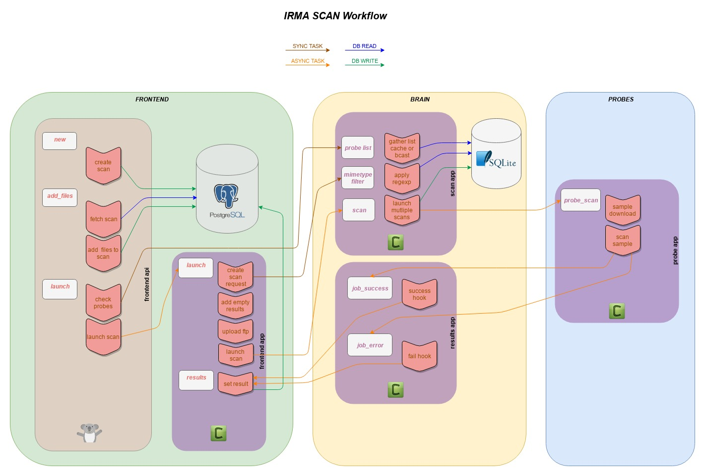

Scan workflow
===================

Frontend API Part (frontend_api/uwsgi+hug)
******************************************

#. A new scan object is created in **PostgreSQL** database.
#. Files are uploaded to the WEB API, stored on Filesystem and registered in **PostgreSQL** database.
#. Scan is launched, an asynchronous task is launched on **Frontend** celery.

Frontend Celery Part (frontend_app/celery)
******************************************

#. Used probes are filtered according to scan options (selected probes, mimetype filtering).
#. Empty results are created in **PostgreSQL** database (one per probe per file).
#. Each file is uploaded to **SFTP** server.
#. For each file uploaded a scan task on **Brain** is launched with the file probelist (according to scan option *force* some results could already be present).

Brain Celery Part (scan_app/celery)
***********************************

#. A new scan object is created in **SQLite** database to track jobs (for canceling).
#. Each file is send for analysis in sent for analysis in every probe selected (each time a probe is available in IRMA, it registers itself to the brain and open a
   **RabbitMQ** Queue named with its probe name, probe list is retrieved by listing active queues).
#. Two callbacks are set on every probe scan tasks, one for success and the other for failure.

Probe Celery Part (probe_app/celery)
************************************

#. Scan task is received with a file id.
#. File is downloaded as temporary file.
#. File is scanned by the probe.
#. Results are sent back to **Brain** to one of the two callbacks set.

Brain Celery Part (result_app/celery)
*************************************

#. successful results are marked as completed in **SQLite** database.
#. successful results are forwarded to **Frontend**.
#. error are marked as completed in **SQLite** database.
#. As there is no result, an error message is generated to tell the **Frontend** the particular job for the file and probe failed.

Frontend Celery Part (frontend_app/celery)
******************************************

#. Results is received for each file and probe.
#. Results are updated in **PostgreSQL** database.
#. If scan is finished, a scan flush task is launched on **Brain** to delete files on **SFTP** server.
