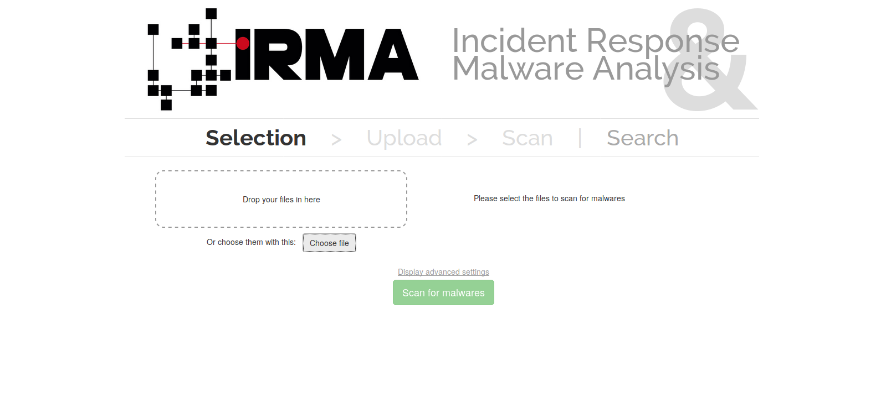
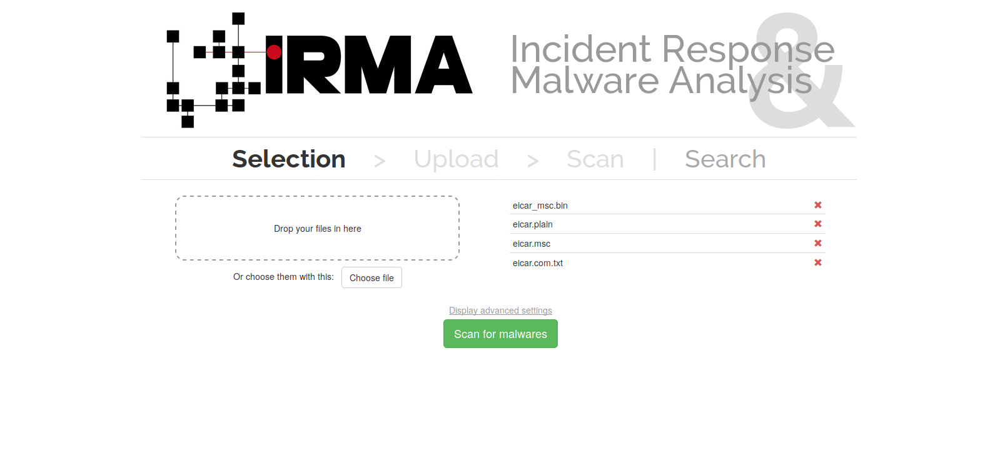
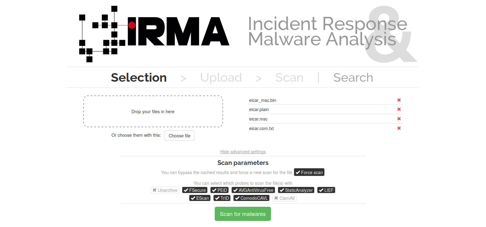
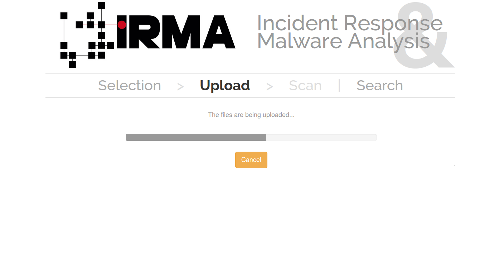
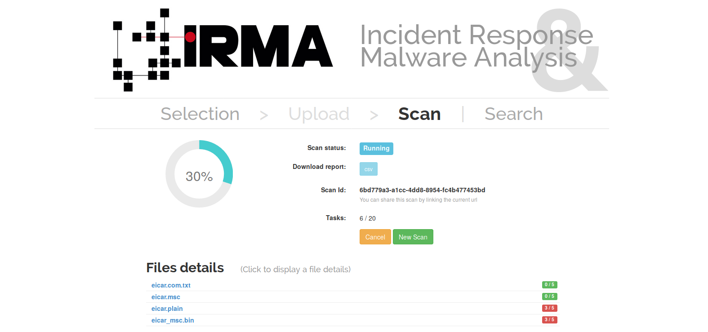
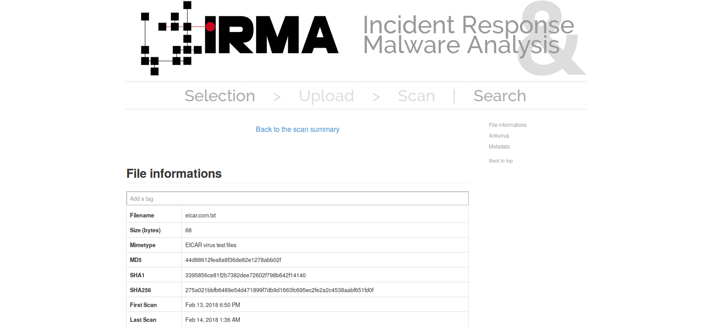
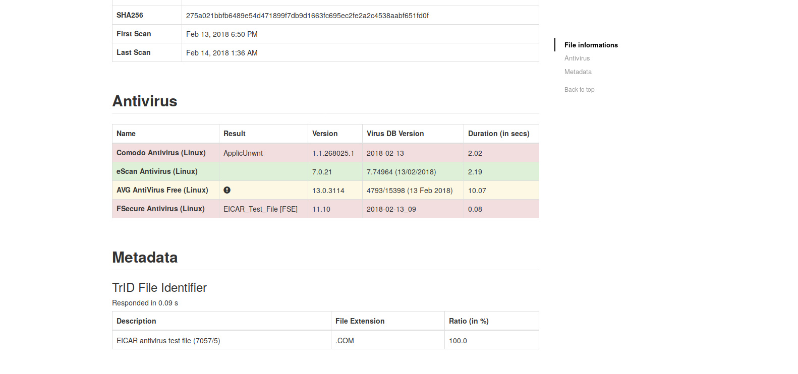

How to do a scan
================

First choose one or multiple files to scan by:

* Drop it in the select area
* Click on "Choose file" button

Now, you can see the selected files on the right.

To cancel a file selection, click on the red cross next to the filename.

By clicking on the "Display advanced settings", you can see and determine scan parameters. Note that the defaults parameters are not reset by default after a scan.

In the scan parameters you can choose if the scans will be forced, meaning that the files are unconditionally scaned, even if there is a cached result. You can choose too which probes will be lauched.

When you are ready, launch the scan by clicking on "Scan for malwares" button.

Wait during the upload of your files.

By now, you are on the results page. At the top, the scan status is displayed :

* The progression rate
* The scan status (if the scan is running or finish)
* The link to download the scan report in csv format
* The scan Id, a unique id to identify this scan that you can share
* The number of probe tasks done on the total number of probe tasks for the scan.

Next, the page displays the list of scan's files and their status. Click on the file's name to display the detailed scan result of a file scan.

In the first part of detailed scan result page, you can obtain information about the scanned file: filename, size, mimetype, different hashes, date of the first scan and the last scan of this file.

In the second part, you can see the details of the differents probe tasks ranked by probe type.

Firstly, the antivirus. For each antivirus, the following information are given:

* The name and the platform used
* The name of threat if it exist
* The version of the antivirus
* The version of the virus database
* The duration of the task

Note there is a color code to quickly see the status of the probe : green if everything is ok, red if a threat was be founded or orange if there was a problem with the probe.

Then, it's the metadata and external parts : each probes of those classes have different ways to display their results.

