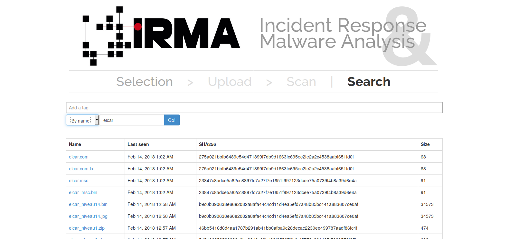

How to do a research
====================

It's possible to recover scan results in the "Search" section.

There are two ways to search scan : a research by name or a research by hash with a sha256.
To this end, select in the scroll bar "By name" or "By hash" and effect your research : then a list of files' results ranked by date is displayed.

.. note:: To add a filter tag, see the section "Playing with tags"
